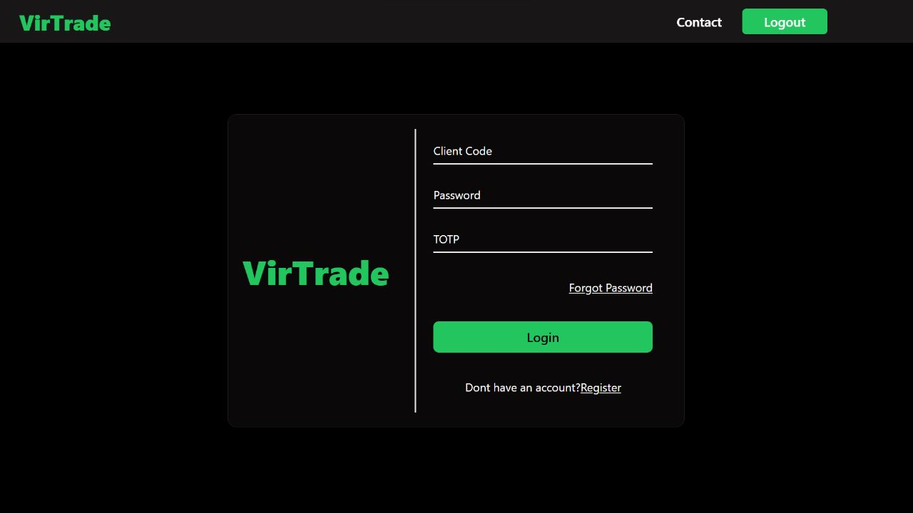
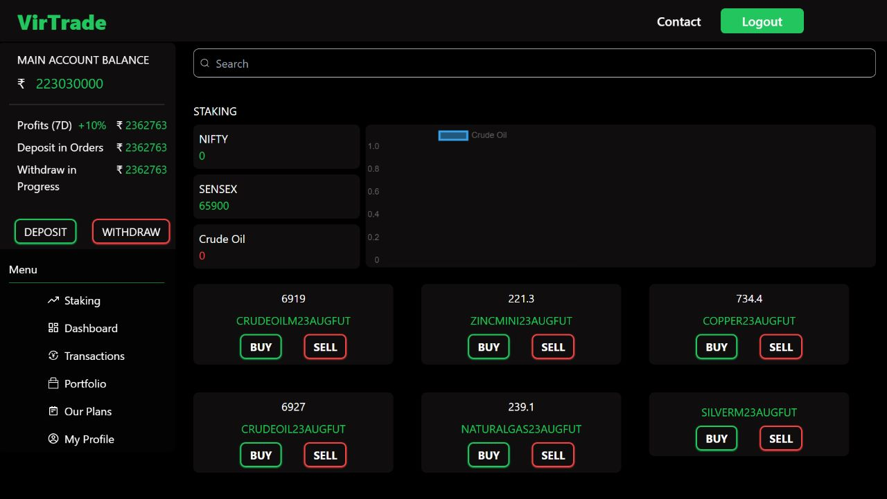
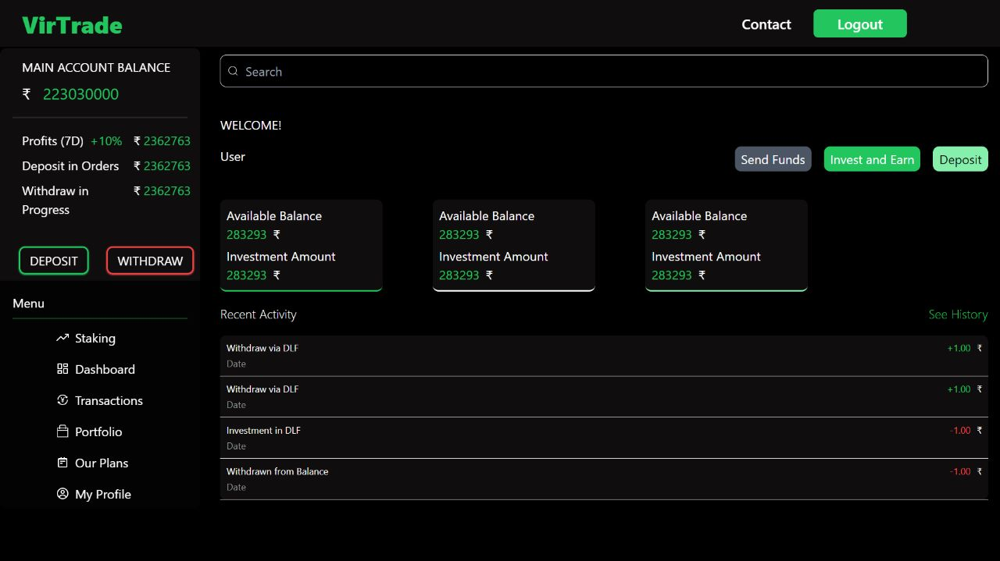
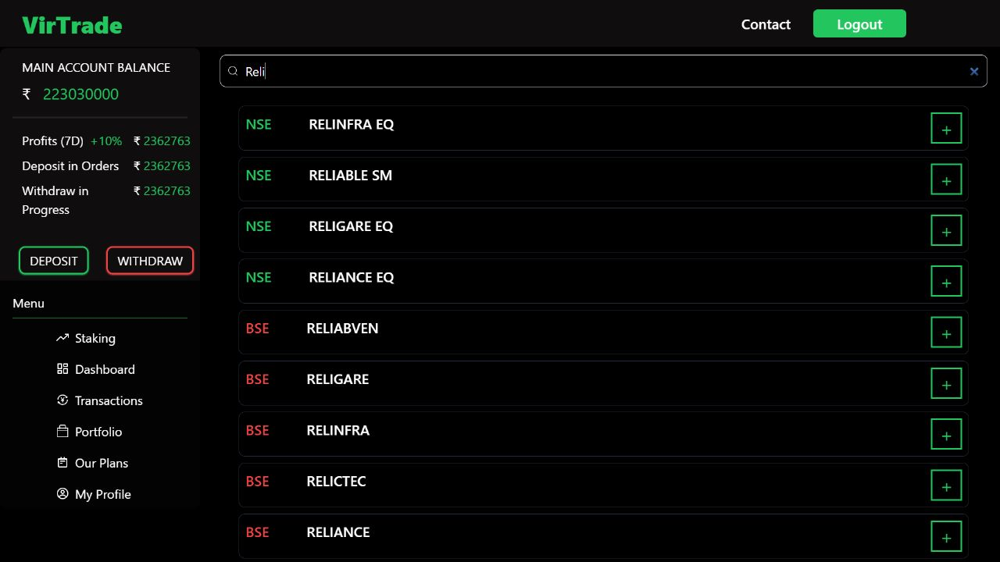
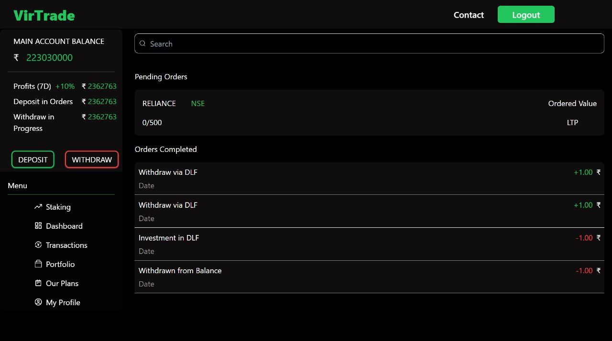
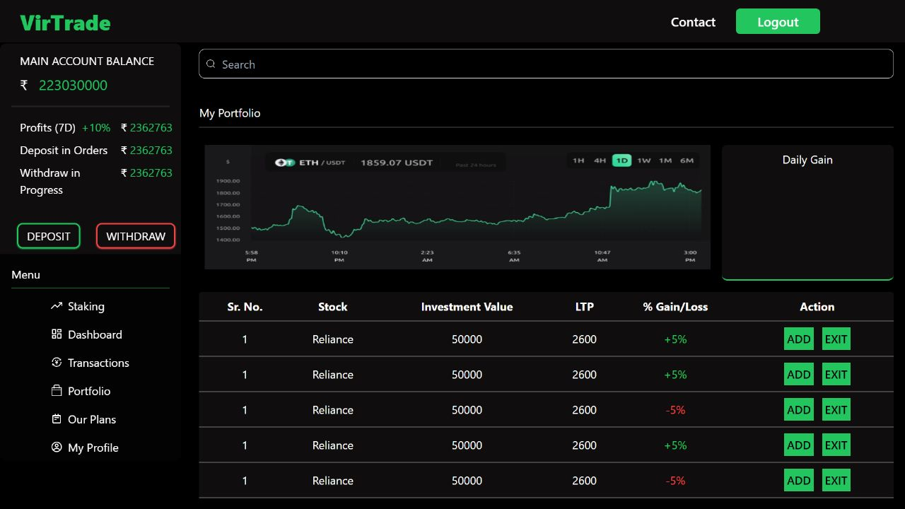

# VirTrade - Virtual Trading Platform

Welcome to VirTrade, a powerful virtual trading platform designed to provide stock market traders with a risk-free environment for practicing their trading strategies. This platform leverages real-time stock price data from Angel One's smartapi, available during market hours, giving users access to up-to-date information for informed virtual trading activities.

## Key Features

- **Next.js:** VirTrade's frontend is built using Next.js, a leading React framework known for its performance and server-side rendering capabilities, ensuring a fast and efficient user interface.

- **Real-time Stock Price Streaming:** Utilizing `socket.io`, we provide a live stream of stock prices from Angel One's smartapi during market hours, giving users real-time access to stock price updates, essential for informed virtual trading activities.

- **Data Visualization:** We employ Chart.js to empower traders on VirTrade to interact with and visualize stock market data through dynamic and informative charts.

- **Tailwind CSS:** Our responsive design, powered by Tailwind CSS, guarantees a consistent user experience across devices of all sizes.

## Usage

Visit ([https://virtrade.netlify.app/](https://virtrade.netlify.app/)) during market hours to practice virtual trading with real-time stock prices. Explore a wide range of stocks and futures, analyze their performance using the interactive charts, and track your progress in honing your trading strategies.

## Contributions

This project demonstrates my expertise in frontend development, real-time data integration, data visualization, and responsive UI design. I'm thrilled to be part of a team that is revolutionizing how traders learn and practice, ultimately enhancing trading skills and financial literacy.

## Technology Stack

- Frontend: Next.js, Chart.js, Tailwind CSS
- API: Angel One's smartapi

Feel free to reach out if you have any questions or if you'd like to discuss the project further. Happy virtual trading!
